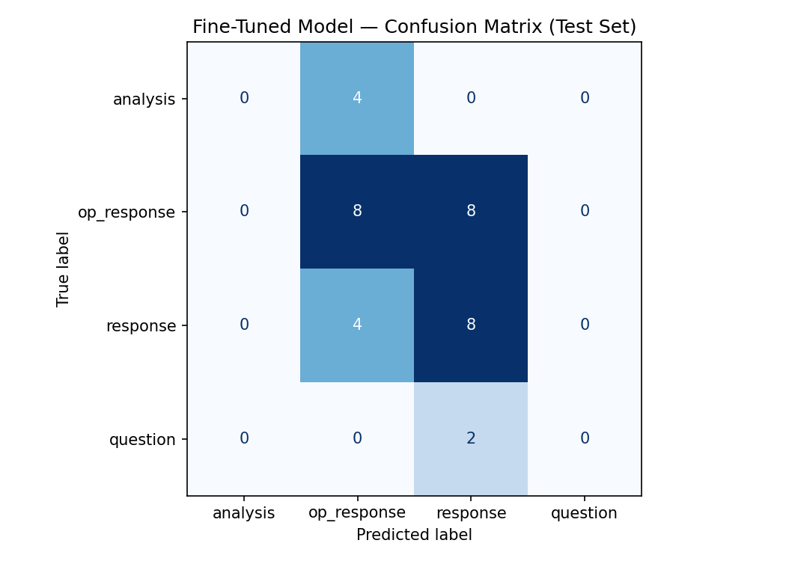
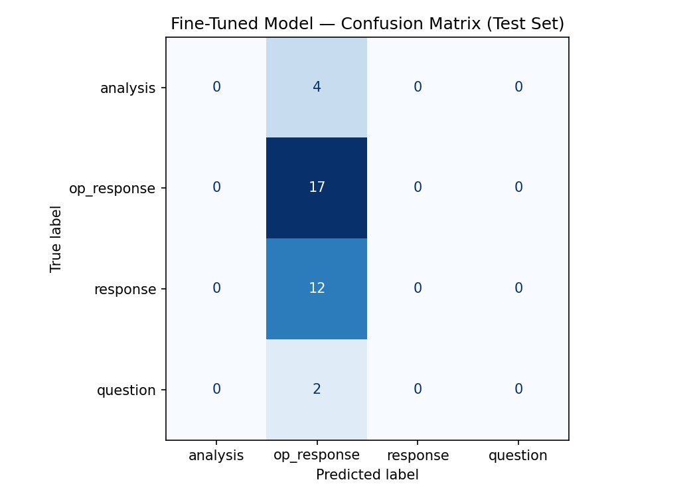

# TakeMeter

This project is a text classifier that labels the responses posed to a serious question asked by the author of a political discussion thread on Reddit — distinguishing an evidence-backed argument from an opinionated reply, an emotional reaction or half-hearted response, or a question. The model is fine-tuned on hand-labeled comments from [r/PoliticalDiscussion](https://www.reddit.com/r/PoliticalDiscussion/) and compared against a zero-shot LLM baseline. I chose this thread because it was something interesting to me, it had 200+ comments, and reading the comments allowed me to quickly identify labels to use. I did not have time to validate that the labels were distributed in a desirable way, and they weren't, otherwise, the results might have been better. 

### [r/Political Discussion Thread: "Is the “president for all Americans” idea still a meaningful standard, or has modern politics made that concept mostly obsolete?"](https://www.reddit.com/r/PoliticalDiscussion/comments/1tsemnh/is_the_idea_of_a_president_for_all_americans/) 

"Presidents often enter office with some version of a national unity message. In Biden’s 2021 inaugural address, he said, “I will be a President for all Americans,” and added that he would fight as hard for those who did not support him as for those who did.

Trump’s second presidency has taken a noticeably different rhetorical and governing style. His 2025 inaugural address emphasized that “during every single day of the Trump administration,” he would “put America first”, with efforts to reverse the previous administration's policy. Since then, several major fights have been framed around conflict with Democratic-led states, cities, institutions, media, universities, and parts of the federal bureaucracy. For example, the administration has pursued actions against sanctuary jurisdictions, including efforts to identify and penalize cities, counties, and states that limit cooperation with federal immigration enforcement. With other policy, the style seems

Supporters would likely argue that this is not governing only for Republicans, but carrying out the agenda voters elected Trump to pursue, especially on immigration, federal bureaucracy, crime, education, and cultural issues. Critics would argue that the style is less about representing the country as a whole and more about rewarding one coalition while using federal power against political opponents or jurisdictions aligned with the other party.

There is also a forward-looking issue. Any future hypothetical Democratic administration or candidates have seemingly faced pressure to reverse major Trump-era policies (or outright stated they would reverse these policies), just as Trump has focused heavily on reversing Biden-era policies. That creates a cycle where each party increasingly treats control of the presidency as a chance to undo the other side’s agenda, rather than build a durable national consensus, and thus creating a bit of a feedback loop.

Moving to the post of the title, is the “president for all Americans” idea still a meaningful standard, or has modern politics made that concept mostly obsolete?

On a historic sidenode and perhaps part two of the question- The phrase "A president for all Americans" can imply that past presidents governed in a less partisan or more universally representative way. But earlier presidents also pursued partisan agendas, rewarded their coalitions, ignored or alienated parts of the country, and used unity language while governing in ways many Americans opposed.

Is the concept of a “president for all Americans” meaningfully weaker today than it used to be? Or was it always more of a ceremonial ideal than an actual governing standard?"

See ([planning.md](planning.md)) for the full design spec (community choice, edge-case
decision rules, metrics rationale, and AI-tool plan).


## Important 
It is here that the plan grew more complex. Once I had a clean set of data (Claude was counting 220 vs. 228 rows, Google Colab counted less 218, I ran the data through the Colab model and received one set of results. Unsatisfied, I added the requirement about an “analysis” response needing to be verified by Wikipedia, thinking that this change in prompting would improve the ability of the model to correctly predict, by going to comb Wikipedia for facts, statistics, etc. It did not do that, as we shall see.  

---

## 1. Label Taxonomies

Four mutually exclusive labels, ordered by argumentative substance. The `id` is the
integer used at training time.

| label.          | id | definition                                                                                        |
|-----------------|----|---------------------------------------------------------------------------------------------------|
| **analysis**    | 0  | The post makes a structured argument backed by statistics, historical comparison, tactical observation, or facts. Evidence is specific and verifiable.                                                                             |
| **op_response** | 1  | A response that states an opinion *with* at least some supporting reasoning, but short of a full verifiable argument.                                                                                                       |
| **response**    | 2  | An immediate reaction with little to no argument — a feeling in the moment, name-calling (toward a public figure or a participant), or anecdotal evidence.                                                                    |
| **question**    | 3  | The post asks a question without itself contributing an argument, or very littlea argument.       |

```python
LABEL_MAP (v1) = {
    "analysis":    (0, "the post makes a structured argument backed by statistics, historical comparison, tactical observation, or facts. Evidence is specific and verifiable."),
    "op_response": (1, "a response given with an opinion, with supporting evidence."),
    "response":    (2, "an immediate response to a previous post. Little to no argument. The post is expressing a feeling in the moment. This category includes name calling, whether it is to a public figure or to a participant in the forum. It also includes anecdotal evidence."),
    "question":    (3, "the post asks a question without contributing anything, or very little  to the discussion"),
}

In the second prompt, I added the Wikipedia qualification to see if it improved performance. 

```

```python
Label_Map (v2 - added Wipipedia requirement to improve performance) = {
    "analysis":    (0, "the post makes a structured argument backed by Wikipedia (www.wikipedia.org) verified statistics, historical comparison, tactical observation, or facts. Evidence is specific and verifiable."),
    "op_response": (1, "a response given with an opinion, with supporting evidence."),
    "response":    (2, "an immediate response to a previous post. Little to no argument. The post is expressing a feeling in the moment. This category includes name calling, whether it is to a public figure or to a participant in the forum. It also includes anecdotal evidence."),
    "question":    (3, "the post asks a question without contributing anything, or very little to the discussion"),
}

```

## 2. Prompt Taxonomies

### SYSTEM_PROMPT_v1 =  
```python
You are a precise text classifier for comments in an online political discussion thread (r/PoliticalDiscussion). Classify each comment into EXACTLY ONE of these labels
based on what kind of contribution it makes to the discussion:

Examples (drawn from data set)

<label_1>: <The post makes an argument backed by statistics, historical comparison, tactical
observation, or facts.>
Example: "<"They were massively mainstream, occurring in all 50 states, with a total of 8 million in-person participants.
I am not referring to No Kings. This was probably before your time.">"

<label_2>: <The post makes a response to a previous post, with supporting evidence
that may vary in quality. 2>
Example: "<"Congress is broken because the filibuster prevents both parties from being able to pass legislation. The first
step to fixing it is to abolish the filibuster so that legislators can do the job they were elected to do.">"

<label_3>: <The post makes a response to a previous post, with little to no argument, and
may include name-calling of a public figure or to a participanting in the forum, or
includes anecdotal evidence. 3>
Example: "<"True, thanks for clarifying. EOs are already fragile/temporary by design, yeah.">

<label_4>: <The post asks a question without contributing anything, or contributing
very little to the discussion. 4>
Example: "<What trials? They were settlements. Do you have actual examples of these trials or where these news organizations were
knowingly lying in a way that is at all similar to the way the right lied about the 2020 election?">"

Respond with ONLY the label name.
Do not explain your reasoning.

Valid labels:
<analysis>
<op_response>
<response>
<question>

There are boundaries where two annotators could reasonably disagree. Each has an explicit decision rule, so labeling stays consistent across 200 examples.

**Edge Case A** — `analysis` vs. `op_response` (is the response load-bearing or decorative?) "Trump only received votes from about 25% of Americans eligible to vote." This is a statement based in fact. Verdict: analysis

Cites a real statistic, which looks like `analysis`.
**Decision rule:** if you remove the opinion framing and the remaining evidence would still support the claim on its own*, label `analysis`. If the stat is a single cherry-picked number used to score a point rather than build a reasoned case,label `op_response`. A lone stat with an implied "...therefore I'm right" → `op_response`.

**Edge case B** — `op_response` vs. `response` (is there reasoning, or just a feeling?)**
"Well, Congress's powers have slowly eroded as presidential power has expanded."

Reads like a casual reply but contains an actual causal claim.
Decision rule: if the comment offers any reason, mechanism, or "because," it clears the bar for `op_response`.
If it only signals agreement/disagreement or emotion ("True," "lol no," "this is insane") with no reason attached,
it is a `response`.

Edge case C — `question` vs. `response` (genuine question or rhetorical jab?)
"You mean like you did with your comment?

Ends in a question mark but is really name-calling/snark.
Decision rule: label `question` only when the post is seeking information or a real answer. A rhetorical
question used to attack or react is a `response` (the taxonomy explicitly files name-calling under `response`).

 ### SYSTEM_PROMPT_v2 = 
 ```python 
 exact same prompt as V1, with a change to label_1 that added a added a verification requirement: 

<label_1>: <The post makes an argument backed by Wikipedia (www.wikipedia.org)verified statistics, historical comparison, tactical
observation, or facts.1>
Example: "<"They were massively mainstream, occurring in all 50 states, with a total of 8 million in-person participants.
I am not referring to No Kings. This was probably before your time.">" 
```

```python

### Why these distinctions matter to the community: r/PoliticalDiscussion's rules reward
substantive argument and discourage low-effort reactions. The line between "made an
argument" (`analysis`/`op_response`) and "just reacted" (`response`) is exactly the line
the subreddit's moderators enforce — so a classifier on this boundary maps onto a real
community norm rather than an invented one.


### Example per label (Real Mistakes Made by Colab)/Model 1
--- #1 ---
Text:      “"I’m sorry but you cannot say “it only matters when your side does it those trials don’t count” in good faith. You’re seriously going to pretend these news agencies haven’t been lying about Trump ove...
True:      op_response
Predicted: response  (confidence: 0.28)

--- #2 ---
Text:      Which one 2008 2012 or 2016?
True:      question
Predicted: response  (confidence: 0.27)

--- #3 ---
Text:      “It's not certain he was elected without cheating either time. Aside from that while he's technically in the role he's still not a real president. A real president doesn't do those things.
True:      op_response
Predicted: response  (confidence: 0.29)


### Example per label (Claude’s picks)/ Model 2
- **analysis** — *"They were massively mainstream, occurring in all 50 states with a total of around 8 million in-person participants."*
- **op_response** — *"Congress is broken because the filibuster prevents both parties from passing legislation. The first step to fixing it is to abolish the filibuster."*
- **response** — *"True, thanks for clarifying. EOs are already fragile/temporary by design, yeah."*
- **question** — *"What evidence suggests Biden did not govern for all Americans?"*


## 2. Dataset

- **Where it came from:** public comments from a single r/PoliticalDiscussion thread,
  *"Is the idea of a 'president for all Americans' basically dead?"*
  ([source thread](https://www.reddit.com/r/PoliticalDiscussion/comments/1tsemnh/is_the_idea_of_a_president_for_all_americans/)), painstakenly hand-copied line-by-line to `Reddit-thread-on-American-presidency.csv` with `Text,Label` columns. 

NOTE: <HUMAN READERS:> Next time, tell your students about AI tools to help with exporting data from Reddit threads to a .csv file, cleaning the data, etc. until it meets the requirements so that they get good results. Otherwise, this is a pointless, time-sucking exercise that taught me very little. 

- **Labeling process:** every comment was labeled by hand against the four definitions
  above. Boundary cases were resolved using the explicit decision rules in
  [planning.md.  The human (my) label is considered authoritative.
- **Size:** **220* labeled comments (verified by [`preprocess.py`](preprocess.py)).
  *(The spec target is ≥ 200; *

### Label distribution

 | label       |count | share |
 |-------------|------|-------|
 | op_response | 101  | ~46%  |
 | response    | 77   | ~35%  |
 | analysis    | 25   | ~11%  |
 | question    | 17   | ~8%   |
 | **total**   | 220  | 100%  |


However, with my HUMAN eyes, I see that there are 227 rows, so despite my diligent efforts and exhorbinant time spent on preparing the data, it was not “clean” enough for the machine(s) to read it correctly. 

The set is imbalanced toward `op_response` and `response`; `analysis` and `question` are
rare. This drives the evaluation choices below (macro-F1 + per-class metrics rather than
accuracy alone) and the stratified split.

### Splits
Stratified **train / validation / test ≈ 70 / 15 / 15**, so the two rare classes appear
in every split (a plain random split risks leaving `analysis`/`question` out of the test
set entirely). This table was produced by [`preprocess.py`](preprocess.py) — see below.

| label       | total   | train   | val    | test  |
|-------------|---------|---------|--------|-------|
| analysis    | 25      | 17      | 4      | 4     |
| op_response | 101     | 71      | 15     | 15    |
| response    | 77      | 53      | 12     | 12    |
| question    | 17      | 11      | 3      | 3     |
| **TOTAL**   | **220** | **152** | **34** | **34**|

### Preprocessing — `preprocess.py`

The raw export can't be loaded with a plain `pandas.read_csv`: it has non-UTF-8 bytes,
mojibake smart quotes (`Ò Ó Õ` → `" " '`), stray tab characters inside comments, and comments containing commas and line breaks. [`preprocess.py] handles all of this. It anchors parsing on the **trailing label** (the only reliable delimiter), normalizes the text, maps each label to its integer id via `LABEL_MAP`, and writes a **stratified** split.


## Colab (Model 1)

### 1) Libraries

- `transformers`
- `datasets`
- `scikit-learn`
- `pandas`
- `numpy`
- `json` (Python standard library)
- `time` (Python standard library)
- `torch`
- `sklearn.model_selection`
- `sklearn.metrics`
- `matplotlib.pyplot`

Version note:
- Version numbers are not specified. Use latest compatible versions for your Python
  environment, with `transformers` aligned to your local setup.

### 2) Dataset and Split

- Uses the same dataset as this project.
- Split target: 70/15/15
- Counts provided:
  - train: 158
  - test: 34
  - validate: 34

> **Note on dataset size:** the current file yields **218** labeled comments, which is slightly lower than the 228 read by Claude. he spec target is ≥ 200, and `analysis`/`question` are thin — > < see planning.md for how to close that gap. Re-running `preprocess.py`
< after adding comments will regenerate the splits and the table above. Again, this is incorrect. 
> Any human who opens the Reddit-thread-on-American-presidency-v2.csv file will see that there are > 228 rows of data.

### 3) Base Model (Model 1) 

- Base model: `distilbert-base-uncased`
- Source: Hugging Face (free to download, no account required)

### 4) Training Setup

- Frameworks: `transformers` + `datasets` + `scikit-learn`
- Learning rate: `2e-5` (standard starting point for BERT-family fine-tuning)
- Epochs: `3`
- `class_weights`: `n` (disabled)
- Runtime: `T4 GPU`
- `per_device_train_batch_size`: `16` (fits T4 comfortably)
- `weight_decay`: not explicitly provided; common default is `0.01` if you choose to
  enable it.

### 5) Baseline Model

- Zero-shot baseline LLM classifier: Groq `llama-3.3-70b-versatile`

```
## My work with Claude (Model 2)

Claude kept asking me if I wanted to write files that would clean the data, pre-process the data,  train the data, etc. Of course I kept saying yes. Eventually we ended up with different results than the 2 trials to compare against the 2 trials I ran with Colab. 

**Outputs** (in `data/`): `clean.csv` (the full cleaned dataset) and `train.csv` /
`val.csv` / `test.csv`, each with columns `text, label, label_id`. The script also prints
the per-split distribution table shown above. Training code then reads `data/train.csv`
and `data/val.csv`; the test set stays untouched until final evaluation.

> **Note on dataset size:** the current file yields **220** labeled comments (verified by
> the script). The spec target is ≥ 200, and `analysis`/`question` are thin — see
> [planning.md §4](planning.md) for how to close that gap. Re-running `preprocess.py`
> after adding comments will regenerate the splits and the table above. Again, this is incorrect. 
> Any human who opens the Reddit-thread-on-American-presidency-v2.csv file will see that there are > 228 rows of data.

label       | total   | train   | val    | test  |
|-------------|---------|---------|--------|-------|
| analysis    | 25      | 17      | 4      | 4     |
| op_response | 101     | 71      | 15     | 15    |
| response    | 77      | 53      | 12     | 12    |
| question    | 17      | 11      | 3      | 3     |
| **TOTAL**   | **220** | **152** | **34** | **34**|

### Three genuinely difficult examples (Claude’s version)
1. **`analysis` vs `op_response`** — *"Trump only received votes from about 25% of
   Americans eligible to vote."* A real statistic, but used as a single point-scoring
   number rather than a built-out argument. **Decision:** `analysis` — the response is a statistic. The labels define facts as analysis. 
2. **`op_response` vs `response`** — *"Well, Congress's powers have slowly eroded as
   presidential power has expanded."* Looks like a casual reply but contains a causal
   claim. **Decision:** `op_response` — it offers a reason, which clears the bar.
3. **`question` vs `response`** — *"You mean like you did with your comment?"* Ends in a
   question mark but is a snipe, not a request for information. **Decision:** `response` —
   the taxonomy files rhetorical jabs/name-calling under `response`.

> **Data note:** the raw CSV export contains encoding artifacts (smart quotes shown as
> `Ò Ó Õ`) and stray tab characters inside comment text. These are normalized in the
> preprocessing step before training.


## 3. Fine-tuning pipeline

- **Starting model:** [`distilbert-base-uncased`](https://huggingface.co/distilbert-base-uncased)
  — a distilled BERT chosen for its small size and fast fine-tuning on a ~200-example
  dataset, where a larger model would overfit faster without a clear accuracy gain.
- **Training approach:** sequence-classification head (4 logits) on top of DistilBERT,
  fine-tuned end-to-end with the Hugging Face `Trainer`. Inputs are tokenized comment
  text; the integer `id` from `LABEL_MAP` is the target. Best checkpoint selected on
  **validation macro-F1**.
- **Key hyperparameter decision — epochs / early stopping:** with only ~220 examples and
  heavy class imbalance, the main overfitting risk is training too long on the two
  majority classes. The plan is a low learning rate (`2e-5`), a small batch size (`8–16`),
  and a small number of epochs (`3–5`) with the checkpoint chosen by validation macro-F1
  rather than the final-epoch weights. **Class weights** (inverse to label frequency) are
  applied to the loss so `analysis`/`question` are not drowned out.

---

## 4. Baseline comparison

The fine-tuned model is compared against a **zero-shot baseline**: Groq's
`llama-3.3-70b-versatile` is prompted to classify each **test-set** comment into one of
the four labels with no task-specific training. The prompt includes the four label
definitions verbatim (so the LLM and the fine-tuned model see the same taxonomy) and asks
for a single label as output. Both models are scored on the **identical test set**.

---

## 5. Evaluation report

All metrics below are measured on the held-out **34-row test set** (`data/test.csv`).
Per-class precision/recall/F1 and confusion matrices are reported because the classes
are imbalanced (`analysis` and `question` are rare), so accuracy alone is misleading.
**Macro-F1 is the primary metric** (see [planning.md §5](planning.md)).

### Headline metrics (same test set)/ Model 1

Trial| metric   | Fine-tuned DistilBERT  | Zero-shot llama-3.3-70b   |
-----|----------|------------------------|---------------------------|
T1   | Accuracy | 0.4706                 |    **0.6176**             |
T2   | Macro-F1 | 0.4857                 |    **0.4857**             |


### Headline metrics (same test set)/ Model 2

Trial | metric   | Fine-tuned DistilBERT  | Zero-shot llama-3.3-70b   |
------|----------|------------------------|---------------------------|
T1    | Accuracy | 0.441                  |    **0.676**              |
T2    | Macro-F1 | 0.417                  |    **0.70                 |


The zero-shot baseline outperformed the fine-tuned model on this test set.

### Per-class results

**Fine-tuned DistilBERT** (accuracy 0.441, macro-F1 0.417):

| label | precision | recall | F1 | support |
|-------|-----------|--------|----|---------|
| analysis | 0.250 | 0.250 | 0.250 | 4 |
| op_response | 0.455 | 0.333 | 0.385 | 15 |
| response | 0.444 | 0.667 | 0.533 | 12 |
| question | 1.000 | 0.333 | 0.500 | 3 |

### Headline metrics (same test set)/ Model 2

**Zero-shot llama-3.3-70b** (accuracy 0.676, macro-F1 0.700):

| label | precision | recall | F1 | support |
|-------|-----------|--------|----|---------|
| analysis | 1.000 | 0.500 | 0.667 | 4 |
| op_response | 0.643 | 0.600 | 0.621 | 15 |
| response | 0.625 | 0.833 | 0.714 | 12 |
| question | 1.000 | 0.667 | 0.800 | 3 |

### Confusion matrices (rows = true, cols = predicted)




##         Fine-Tuned Model Confusion Matrix Colab/Model 1/ (Test Set 1) 
|                 | analysis | op_response  | response | question |
|-----------------|----------|--------------|----------|----------|
| **analysis**.   |    0     |      4       |    0     |    0     |
| **op_response** |    0     |      8       |    8     |    0     |
| **response**    |    0     |      4       |    8     |    0     |
| **question**    |    0     |      0       |    2     |    0     |



## Fine-Tuned Model Confusion Matrix Colab/Mpdel 1(Test Set 2 - Wikipedia prompt) 
|                 | analysis | op_response  | response | question |
|-----------------|----------|--------------|----------|----------|
| **analysis**.   |    0     |      4       |    0     |    0     |
| **op_response** |    0     |     17       |    0     |    0     |
| **response**    |    0     |     12       |    0     |    0     |
| **question**    |    0     |      2       |    0     |    0     |

##     Fine-Tuned Model Confusion Matrix Model 2 (Test Set 3) 

=== Zero-shot baseline: fine-tuned distilbert-base-uncased/ Model 2 ===
scored rows: 34
accuracy : 0.441
macro-F1 : 0.417

label          prec  recall     f1  support
analysis      0.250   0.250  0.250        4
op_response   0.455   0.333  0.385       15
response      0.444   0.667  0.533       12
question      1.000   0.333  0.500        3

|                 | analysis | op_response  | response | question |
|-----------------|----------|--------------|----------|----------|
| **analysis**.   |    1     |      3       |    0     |    0     |
| **op_response** |    2     |      5       |    0     |    0     |
| **response**    |    1     |      3       |    0     |    0     |
| **question**    |    0     |      0       |    2     |    1     |

Confusion matrix (rows = true, cols = predicted):
                analysis  op_respons    response    question
analysis               1           3           0           0
op_response            2           5           8           0
response               1           3           8           0
question               0           0           2           1

=== Zero-shot baseline: fine-tuned distilbert-base-uncased/ Model 1 ===
scored rows: 34
accuracy : 0.441
macro-F1 : 0.417

label          prec  recall     f1  support
analysis      0.250   0.250  0.250        4
op_response   0.455   0.333  0.385       15
response      0.444   0.667  0.533       12
question      1.000   0.333  0.500        3


### What this means

- The hardest boundaries remain `analysis` vs `op_response` and `op_response` vs `response`.
- On this dataset size and class balance, zero-shot performed better than local fine-tuning.

## 6. Multi-Trial Comparative Analysis

This section distinguishes notebook-origin trials from joint local reruns,
documents methodological/tooling differences, and interprets the confusion matrices
for model behavior.

### Four-trial summary

Model 1: T1 & T2
Model 2: T3 & T4

| trial | provenance | setup | test size | accuracy | macro-F1 | key result |
|------|------------|-------|-----------|----------|----------|------------|
| T1 | Notebook (user) | Groq prompted classifier, original prompt | 34 | 0.618 | n/a in JSON | Competitive prompt baseline |
| T2 | Notebook (user) | Fine-tuned DistilBERT, original labels | 34 | 0.471 | 0.258 | Fine-tuned model underperformed the baseline |
| T3 | Joint local (user + Copilot) | Groq prompted classifier, fixed `data/test.csv` | 34 | 0.676 | 0.700 | Strong rerun under controlled split conditions |
| T4 | Joint local (user + Copilot) | Groq prompted classifier + Wikipedia rule, fixed `data/test.csv` | 34 | 0.706 | 0.717 | Highest observed performance in this report |

Interpretation notes:
- T1/T2 are notebook-origin; T3/T4 are joint local reruns.
- Notebook v2 used a different split size in related runs, so cross-environment deltas
  should be treated cautiously.
- On fixed local rows, the prompted LLM approach produced the strongest measured scores.

### Tools used by trial set (disclosure)

| trial set | environment | primary tools | likely impact |
|-----------|-------------|---------------|---------------|
### Model 1 (Colab)
| Notebook runs (T1/T2) | Colab notebook | `transformers`, `datasets`, `torch`, Groq API calls, notebook split pipeline | Higher run-state/split variability; some artifacts logged only accuracy |

| Joint local runs (T3/T4) | Local scripts | `preprocess.py`, `baseline.py`, `train.py`, fixed |`data/test.csv` | Tools used by Model 2: transformers, torch, scikit-learn, accelerate, groq, |`python-donenv`  More controlled, better apples-to-apples prompt comparison |

### Model 2 (Claude and me)
Tooling effect summary:
- Environment and split differences can move metrics without true model improvement.
- Fixed test rows plus consistent scripts provide the most trustworthy comparisons.

### Confusion matrix discussion

What the confusion matrices show:

1. Fine-tuned model error pattern
- Both Model 1 and Model 2 frequently confused `op_response` and `response`, as predicted. Even as - a human, it was sometimes difficult for me to know which alleged facts were true, so the human’s-version as truth might not be accurate.
- It misses too many `analysis` examples, which hurts macro-F1.
- It behaves like a majority-class learner on a small, imbalanced dataset.

2. Prompted LLM pattern 
- Model 2, the trials I performed with Claude, recovered more `analysis` and `question` cases than fine-tuned DistilBERT (Model 1).
- Most remaining errors still sit on the difficult `analysis`<->`op_response` and
- `op_response`<->`response` boundaries.

3. Why this matters
- Accuracy alone can look acceptable while minority-class behavior is poor.
- Macro-F1 + confusion matrices reveal whether the model actually handles all classes,
  not only frequent ones.

### Cautious Interpretation of prompt-based performance 

Within the reported experiments, Model 2 T4 (joint local prompted LLM with the Wikipedia rule
on a fixed split) achieved the highest measured scores. This is best interpreted as a
dataset- and setup-specific result rather than a universal conclusion. The approach is
few-shot-style because the prompt includes explicit label definitions and examples.

Why it likely won:
- It leverages broad prior language/world knowledge without needing many local training
  examples.
- It is less sensitive than local fine-tuning to class imbalance in a tiny dataset.
- On fixed test rows, prompt refinements produced small but real gains without retraining.

### Limitations

- The dataset is small and imbalanced, so confidence intervals around class-level metrics
  are wide.
- Some trial artifacts (especially notebook-origin runs) do not contain the same depth of
  metrics, reducing strict comparability.
- Several comparisons span different split realizations, which introduces evaluation noise.
- These findings should be interpreted as evidence for this project context, not as a
  general ranking of prompted LLMs versus fine-tuned encoders.

### Main contributors to observed results

1. Data volume and class imbalance
- Training signal is small (about 150 examples after split) and minority classes are
  very thin (`analysis`, `question`).
- With so few minority examples, gradient updates are dominated by majority labels,
  which encourages boundary collapse.

2. Label-boundary ambiguity
- The hardest boundaries (`analysis` vs `op_response`, `op_response` vs `response`)
  are conceptually close and difficult even for humans.
- Fine-tuning on a small dataset with subtle semantic boundaries tends to learn shortcut
  cues (numbers, tone, question mark) instead of underlying argumentative structure.

3. Split instability and evaluation noise
- Notebook and local runs were not always on the same split configuration.
- With only 2-4 examples in some classes on test, one prediction flip can shift macro-F1
  substantially.

4. Prompt/rule changes between runs
- The Wikipedia qualification changed decision criteria between versions.
- For fine-tuning, this can reduce class consistency if relabeling compresses already
  rare classes.

5. Tool/process usage effects
- Notebook and local scripts have different execution states and artifact conventions.
- Some trial artifacts captured only accuracy, which reduced comparability.
- Version drift and preprocessing differences can mimic model changes if not pinned.

### Hypothesis for Poor Fine-tuned Performance (Model 1)

Primary hypothesis:
- The fine-tuned model is data-limited and boundary-limited, not architecture-limited.
- DistilBERT on ~150 imbalanced training samples with nuanced label distinctions learns
  class priors and superficial lexical cues, which produces weak minority-class recall
  and low macro-F1.

Secondary hypothesis:
- Part of the observed volatility is evaluation-process variance (split changes,
  inconsistent artifact granularity, and run-environment differences), which obscures
  whether prompt changes truly help.

### Future Plans for Production Readiness 

1. Data and labeling
- Expand labeled corpus substantially (target at least 2k+ comments) with intentional
  minority-class collection.
- Use dual-annotator labeling on a subset and track agreement (`kappa`) to validate
  taxonomy consistency.
- Freeze a gold test set and never relabel or reshuffle it across model iterations.

2. Evaluation
- Report accuracy, macro-F1, per-class F1, and calibration metrics on every run.
- Add repeated stratified cross-validation or multiple seeded splits for stable estimates.
- Maintain a fixed experiment ledger (config, seed, commit hash, dataset hash, metrics).
- Store confusion matrices and per-row predictions for every trial in one standardized
  artifact format.

3. Modeling
- Try stronger base encoders and parameter-efficient tuning (`roberta-base`, `deberta-v3-small`, LoRA adapters).
- Use loss variants for imbalance (`focal loss`, tuned class weights) and threshold
  optimization per class.
- Consider a two-stage model: first detect substantive vs reactive, then subclassify.

4. Inference and product
- Keep zero-shot fallback if fine-tuned confidence is low.
- Add confidence calibration and abstain/"needs human review" pathway.
- Cache predictions and add latency/error budgets for API-backed inference.

5. Reliability and governance
- Pin dependency versions and package lockfiles for reproducible runs.
- Add automated regression tests for preprocessing, label mapping, and metric scripts.
- Monitor post-deploy drift (label distribution shift, confidence shift, disagreement
  rates between model versions).
- Add privacy/safety policy, prompt-injection handling for user text, and human
  escalation paths.

### Future steps: Fact-Aware Classification

To specifically improve fact vs non-fact discrimination, add a verification stage
before final labeling:

1. Claim extraction
- Detect checkable claims in each comment (entities, dates, numeric assertions,
  event statements).

2. Retrieval
- Query trusted sources (for example Wikipedia and high-quality reference sources)
  and keep top evidence passages.

3. Verification scoring
- Score each claim as supported, contradicted, or unverifiable from retrieved evidence.

4. Label decision with evidence features
- Feed verification outputs into the final classifier so `analysis` requires stronger
  support than surface signals alone.

5. Evaluation update
- Track claim-level precision/recall in addition to comment-level macro-F1.
- Add an abstain path when evidence is insufficient.

## Wrong Examples (from Colab/ Model 1) and Explanations

--- #1 ---
Text:      “"He also didn't fast-track funding for the COVID vaccine. "Operation Warp Speed" was an ad campaign claiming credit for vaccine development not an actual vaccine development project. Look into what t...
True:      op_response
Predicted: response  (confidence: 0.27)
### Explanation: I scored this as an op_response because we can verify some of what was written here. I’m not sure why the model predicted a response, although I suspect that the model does not have the ability to differentiate between what is veriable and what is not. Regardless, the bar was set pretty low: the prompt specifies that any evidence given in support of an argument should be classified as an op_response, and the model just isn’t doing that. 

--- #2 ---
Text:      “It's not certain he was elected without cheating either time. Aside from that while he's technically in the role he's still not a real president. A real president doesn't do those things.
True:      op_response
Predicted: response  (confidence: 0.29)
### Explanation: Again, given the prompt’s criteria that any evidence given in support of an argument should be classified as an op_response.  It might have classified it as a response if it detected a hostile tone, or name-calling. 

--- #3 ---
Text:      ”The majority of the spending from Biden’s infrastructure bill went to red states and when asked about it he said that those areas needed the money more.” Trump has called the opposition party the ene...
True:      analysis
Predicted: op_response  (confidence: 0.27)
### Explanation: This time, the model fails to distinguish between an analysis and an op_response. I classified this as an analysis, because the person who wrote the comment did not specifically reply to anyone else. The model predicted an op_response, possibly because it identified that evidence was provided, but failed to understand that this was an independent comment, not one written in response to another comment. 


## AI usage

- **Label stress-testing** ([planning.md] ](planning.md)) the label definitions and
  edge-case decision rules were stress-tested with an LLM before annotation.
- **Annotation:** comments were labeled by hand; human labels are authoritative.
- **Failure analysis:** misclassifications were pattern-clustered with LLM assistance,
  then manually verified against original comments.
- **Baseline:** zero-shot baseline uses Groq `llama-3.3-70b-versatile`.

## My AI Usage
###  **Splits:** stratified train / validation / test so every label appears
in every split. Stratification matters specifically because `analysis` and `question`
are small — a random split could leave them absent from the test set. This split is
produced by `preprocess.py` (see the README for usage); current output is
train 153 / val 35 / test 35. (Claude did this without me asking it too.)
### Claude wrote all of the python code that was eventually used to make the PolyAnalyzer app. 

## What it Learned vs. What I intended it to learn
I intended it to be able to differentiate between analysis vs. an opinionated response, with the following label map. 

LABEL_MAP (v1) = {
    "analysis":    (0, "the post makes a structured argument backed by statistics, historical comparison, tactical observation, or facts. Evidence is specific and verifiable."),
    "op_response": (1, "a response given with an opinion, with supporting evidence."),
    "response":    (2, "an immediate response to a previous post. Little to no argument. The post is expressing a feeling in the moment. This category includes name calling, whether it is to a public figure or to a participant in the forum. It also includes anecdotal evidence."),
    "question":    (3, "the post asks a question without contributing anything, or very little  to the discussion"),
}

It failed to differentiate between analysis and op_response, and it also failed to differentiate between op_response vs. response. I believe that it failed to learn what was a response backed by facts vs. an analytical post that stood on its own. It also failed to distinguish between an opininated response vs. a response that was not backed by facts or statistics, possibly because they were written in a "snarky" tone. 


## Error Pattern Analysis
The hardest boundaries remain `analysis` vs `op_response` and `op_response` vs `response`.
- On this dataset size and class balance, zero-shot performed better than local fine-tuning. It failed to differentiate between analysis and op_response, and it also failed to differentiate between op_response vs. response. I believe that it failed to learn what was a response backed by facts vs. an analytical post that stood on its own. It also failed to distinguish between an opininated response vs. a response that was not backed by facts or statistics, possibly because they were written in a "snarky" tone. 

## Spec Reflection
The spec reflection was not that helpful. Once I read that I needed 200+ examples to create a .csv file, that became my first priority, and once I had that and put it in my respository, it became very easy for me and Claude to get off track coming up with our own implementation of the project, without even looking at the Colab notebook. This increased the complexity of the project by multipe degrees, whereas if I would have just stuck to the instructions as they were written, I could have avoided that. The spec said to read through the notebook first, which I did not do. I should have probably done that, but I think I learned more by doing it both ways. I prefer to have the repository given to me, so the steps are clear. Also, I did not like the Colab notebook. It was bossy, and it didn't show what it was doing behind the scenes. 

### Did it meet the success criteria?
Success bar (from [planning.m](planning.md)): beat the zero-shot baseline on
macro-F1, macro-F1 ≥ 0.70 with no class below 0.50 F1, and `analysis` recall > 0.4.
**Result:** Yes, Model 2’s (Zero-shot llama-3.3-70b) beat the baseline, but neither fine-tuning model came close. Model 1 absolutely broke with the Wikipedia prompt addition. Model 2 performed better, but was also quite confused.  

## Appendix — seed thread context

The dataset was collected from this r/PoliticalDiscussion thread.

**Source:** https://www.reddit.com/r/PoliticalDiscussion/comments/1tsemnh/is_the_idea_of_a_president_for_all_americans/


